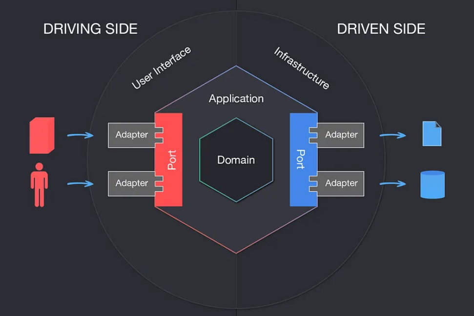

# Purpose of This Project 
The purpose of this project is to demonstrate how to implement a hexagonal architecture in a Spring Boot application and gradle multi module. 
- Why hexagonal architecture? 
  - Separating core domain logic from the adapters makes the application easier to change and test.
- Why gradle multi module? 
  - Applications often have API and batch components, and it is a good way to separate concerns and make the application more modular and testable.
  - It's easy to share core business logic by adding [core module](./example-core) as a dependency to other modules([example-api](./example-api), [example-batch](./example-batch)). 
# Structure

- example-api: module to define REST APIs, you can think of this as a module for REST API adapters 
- example-batch: module to define batch jobs   
- example-core: module to define the core business logic and ports (and some commonly used adapters such as repositories)  
  - application: define ports e.g. facade interfaces
  - domain: define classes for business logic logic e.g. entities, repositories, value objects, services
    - note that service classes can bypass application package and be referenced directly from other modules
  - infrastructure:
    - config: where the configuration of the application is defined  
    - persistence: where the implementation of the ports for persistence are defined e.g. JPA repositories, etc. 

# Keep In Mind 
- example-core should not depend on example-api or example-batch 
- core business logic should be located in example-core
  - example-api and example-batch should use business logic defined in the example-core 
